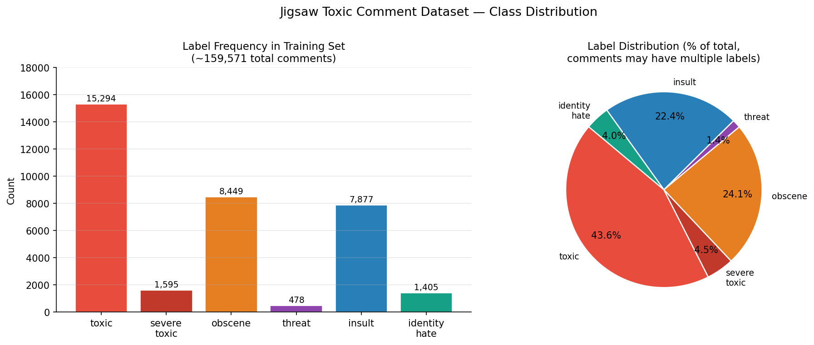
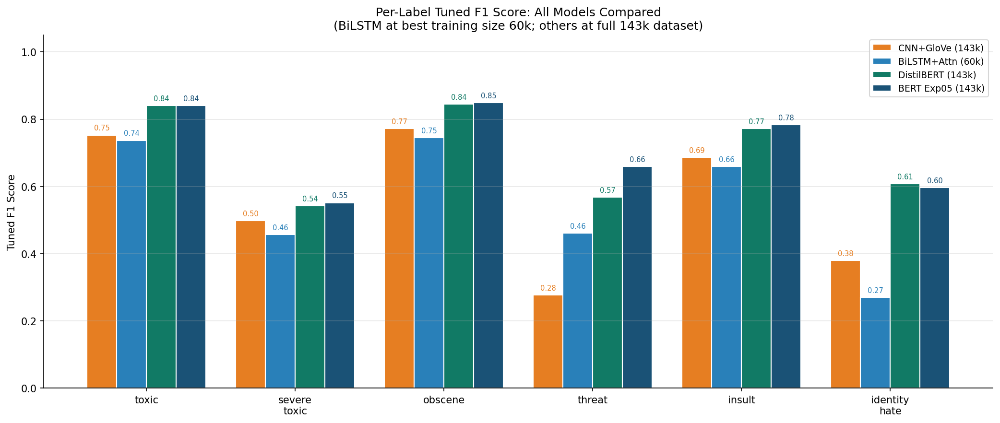
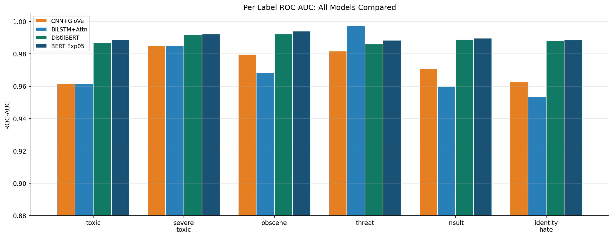
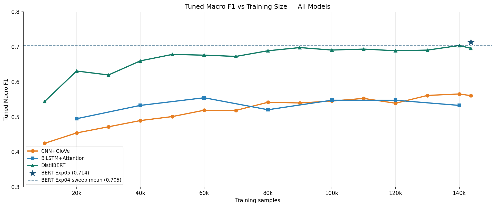
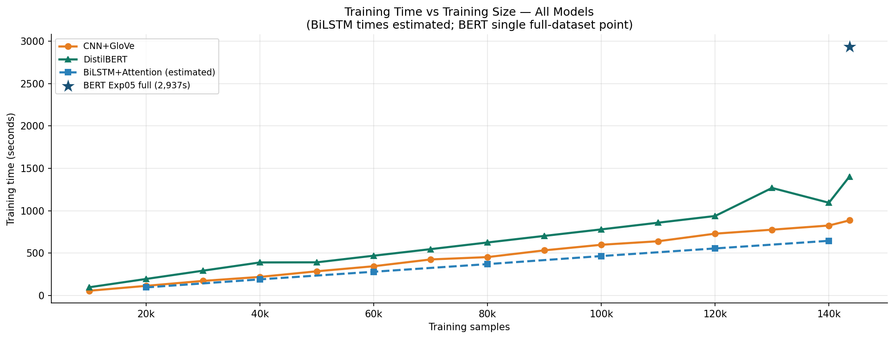
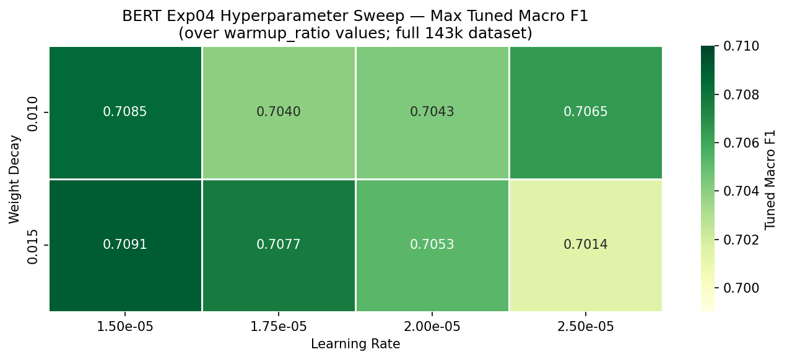
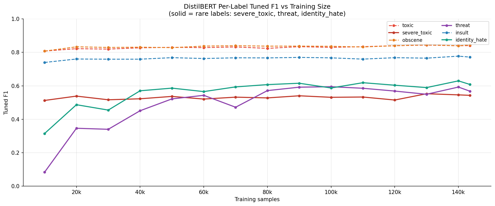
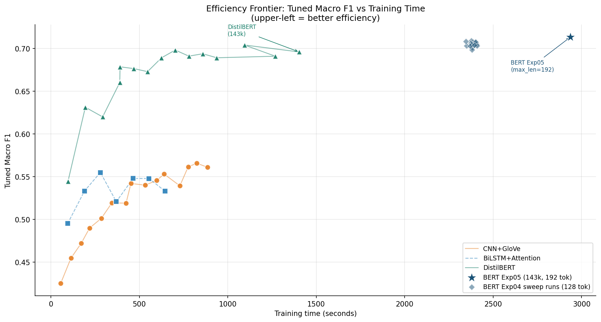
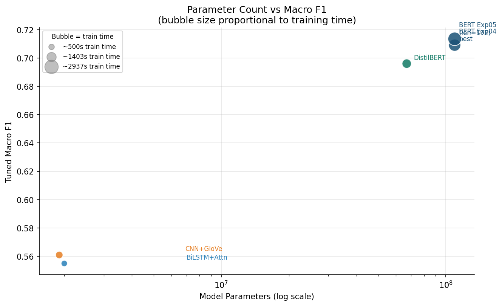
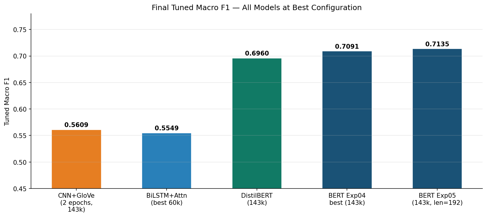

# Toxic Comment Detection: Comparing Task-Trained Neural Networks and Pretrained Transformer Models

**Course:** CMPE 258 — Deep Learning  
**Team:** Dan Lam (011383814) · Cameron Ghaemmaghami (013120094) · Alicia Kim (015191748) · Pranav Sehgal (015396147)  
**Dataset:** Kaggle Jigsaw Toxic Comment Classification Challenge

---

## Table of Contents

1. [Abstract](#1-abstract)
2. [Problem Description](#2-problem-description)
3. [Dataset and Exploratory Data Analysis](#3-dataset-and-exploratory-data-analysis)
4. [Preprocessing Pipeline](#4-preprocessing-pipeline)
5. [Model Architectures and Methodology](#5-model-architectures-and-methodology)
6. [Training Strategy and Evaluation Protocol](#6-training-strategy-and-evaluation-protocol)
7. [Results](#7-results)
8. [Cross-Model Comparison and Analysis](#8-cross-model-comparison-and-analysis)
9. [Discussion](#9-discussion)
10. [Conclusions](#10-conclusions)

---

## 1. Abstract

This report presents a comprehensive multi-label text classification study comparing four deep learning architectures on the Jigsaw Toxic Comment Classification dataset (~160k Wikipedia comments, 6 toxicity labels). We evaluate two task-trained models — a **CNN with GloVe embeddings** and a **BiLSTM with learned attention** — against two pretrained transformer models — **DistilBERT** and **BERT-base**. All models are evaluated on identical data splits using the same metric suite (tuned macro/micro F1, ROC-AUC per label) and compared on training time, parameter count, and data efficiency. BERT achieves the highest tuned macro F1 (0.7135 at max_length=192), DistilBERT reaches 0.6960 in roughly half the training time, while the task-trained models plateau at ~0.56 macro F1 despite being 33–55× smaller. Rare labels (threat, identity_hate, severe_toxic) are the primary discriminator between architectures, with BERT's longer context window providing the clearest advantage on the `threat` label (+0.065 F1 over DistilBERT).

---

## 2. Problem Description

Automated content moderation at platform scale requires models that are accurate, efficient, and interpretable. The challenge is framed as **multi-label binary classification**: each comment may belong to any subset of six toxicity categories simultaneously. This differs from multi-class classification in that labels are not mutually exclusive — a comment can be both `toxic` and `obscene` — requiring separate binary classifiers per label sharing a common representation.

**Key challenges:**

- **Severe class imbalance:** The `threat` label appears in only ~0.3% of comments; `identity_hate` in ~0.9%. Standard threshold tuning (t=0.5) systematically under-detects rare labels.
- **Context dependency:** Short toxic comments rely on local phrase patterns; longer comments may bury toxicity in subordinate clauses — motivating the comparison of local (CNN) vs. sequential (BiLSTM) vs. global attention (transformers) architectures.
- **Computational cost:** Fine-tuning BERT takes ~49 minutes at full data; CNN trains the same data in under 15 minutes on CPU. The project quantifies this trade-off empirically across matching training sizes.

---

## 3. Dataset and Exploratory Data Analysis

### 3.1 Dataset Overview

| Property | Value |
|---|---|
| Source | Kaggle Jigsaw Toxic Comment Classification Challenge |
| Total comments | ~159,571 |
| Training split | 143,613 (90%) |
| Validation split | 15,958 (10%) |
| Split method | Iterative stratification (skmultilearn), `random_state=42` |
| Labels | 6 binary categories (multi-label) |
| Input | Raw text comment strings |

### 3.2 Label Distribution



The dataset is heavily imbalanced at two levels:

**Between-label imbalance:** The `toxic` label accounts for ~9.6% of comments while `threat` appears in just 0.3%. The ratio between the most and least common label is approximately 32:1.

| Label | Count | % of Total |
|---|---|---|
| toxic | 15,294 | 9.58% |
| obscene | 8,449 | 5.29% |
| insult | 7,877 | 4.94% |
| identity_hate | 1,405 | 0.88% |
| severe_toxic | 1,595 | 1.00% |
| threat | 478 | 0.30% |

**Within-label imbalance:** Even the most common label (`toxic`) is present in fewer than 10% of comments, making all six a rare-event detection problem. This drives both the choice of loss function (`BCEWithLogitsLoss` with `pos_weight`) and the necessity of per-label threshold tuning.

### 3.3 Label Co-occurrence

Toxicity labels frequently co-occur: comments labeled `severe_toxic` are almost always also labeled `toxic`; `obscene` and `insult` heavily overlap. `threat` and `identity_hate` are more independent, appearing with lower co-occurrence rates. This co-occurrence structure means that models which learn a good representation for `toxic` get partial signal for related labels for free, while `threat` must be learned from a sparser supervision signal.

### 3.4 Text Characteristics

- **Comment length:** Highly variable — ranging from single words to multi-paragraph rants. The median comment length is approximately 60 words; the 95th percentile is ~350 words.
- **Linguistic noise:** Comments contain slang, abbreviations, deliberate misspellings, and emoji. This affects word-level tokenizers (CNN, BiLSTM) more severely than subword tokenizers (BERT, DistilBERT), as rare misspellings map to `<unk>` in fixed vocabularies.
- **Toxicity length correlation:** Toxic comments are on average shorter than clean comments — most toxic utterances are brief, concentrated attacks. This partially explains why `max_len=100` is sufficient for the BiLSTM to capture most signal without longer sequences.

---

## 4. Preprocessing Pipeline

All models share a unified preprocessing interface (`preprocessing/text_preprocessing.py`) with model-specific functions returning typed dataclasses.

### 4.1 Common Steps (All Models)

- **Text cleaning:** Lowercasing, removal of excessive whitespace, URL normalization
- **Label extraction:** Six binary label columns, cast to float32 (for BCEWithLogitsLoss compatibility)
- **Data splitting:** Iterative stratification over all 6 labels (`use_iterative_stratify=True`), ensuring label co-occurrence distributions are preserved in both splits

### 4.2 Task-Trained Models (CNN, BiLSTM)

```
Raw text
    → word tokenization (whitespace + punctuation splitting)
    → frequency filtering (min_freq=2)
    → vocabulary capping (max_vocab=25,000–50,000)
    → integer index sequence
    → zero-padding to fixed max_len (100–256)
    → (BiLSTM only) sequence length tracking for pack_padded_sequence
```

The vocabulary is built **from the training subset only** at each sweep step, meaning smaller training sizes produce smaller vocabularies. At 10k samples the CNN vocabulary is approximately 8k tokens; at full data it saturates the 50k cap.

### 4.3 Pretrained Transformer Models (BERT, DistilBERT)

```
Raw text
    → HuggingFace AutoTokenizer (WordPiece subword tokenization)
    → max_length truncation (128 for DistilBERT/BERT-Exp04, 192 for BERT-Exp05)
    → [CLS] / [SEP] insertion
    → attention_mask + token_type_ids generation
    → pt tensors returned directly
```

Transformer tokenizers handle OOV gracefully through subword decomposition — "fkin" becomes "f" + "##kin" rather than `<unk>`. This is a meaningful advantage on noisy social media text.

---

## 5. Model Architectures and Methodology

### 5.1 CNN + GloVe Embeddings

**Architecture (TextCNN):**

```
Input (integer sequence, max_len=256)
    → GloVe embedding (100-dim, pretrained, frozen)
    → parallel conv1d filters: [2, 3, 4, 5]-gram, 128 filters each
    → ReLU → global max-pool per filter
    → concat (512-dim)
    → dropout(0.5)
    → Linear(512 → 6)
    → BCEWithLogitsLoss
```

**Rationale:** CNNs capture local n-gram patterns efficiently. GloVe embeddings bring pretrained semantic relationships into a fast, purely convolutional forward pass. The model has no recurrence and no global attention, so it operates in a single parallel pass over all positions.

**Training config:**
- `max_len=256`, `max_vocab=50,000`, `min_freq=2`
- `batch_size=64`, `lr=1e-3`, `epochs=2` (best epoch determined by sweep)
- Loss: `BCEWithLogitsLoss` with `pos_weight` per label
- Device: CPU (~15 min at full data)
- Parameters: ~1.9M

### 5.2 BiLSTM + Attention

**Architecture (AttentionBiLSTM):**

```
Input (integer sequence, max_len=100, with lengths)
    → Embedding(vocab_size × 100-dim, learnable)
    → Spatial Dropout(0.2) [applied on embedding dim]
    → pack_padded_sequence → BiLSTM(hidden=128, bidirectional)
        → hidden dim: 256 (128 forward + 128 backward)
    → pad_packed_sequence → LayerNorm(256)
    → Attention network: Linear(256→128) → Tanh → Linear(128→1)
        → mask padding positions (fill -1e9)
        → softmax over sequence → weighted sum → 256-dim context vector
    → Dropout(0.4)
    → Linear(256 → 6)
    → BCEWithLogitsLoss with pos_weight
```

**Key design choices:**
- **Packed sequences** avoid wasted computation on padding tokens
- **Spatial dropout** (Dropout1d on the embedding dimension) prevents entire feature dimensions from co-adapting
- **LayerNorm** before attention stabilizes training and reduces sensitivity to sequence length
- **Learned attention** weights each token's contribution to the final representation, theoretically highlighting the toxic tokens

**Training config:**
- `max_len=100`, `max_vocab=25,000`, `embed_dim=100`, `hidden=128`
- `batch_size=128`, `lr=1e-3`, Adam + StepLR(`step=3`, `gamma=0.5`)
- Early stopping: `patience=3`, `min_delta=0.005` on val macro F1
- `clip_grad_norm=5.0`
- Parameters: ~2M

### 5.3 DistilBERT

**Architecture:** `distilbert-base-uncased` — a 6-layer distilled version of BERT with 40% fewer parameters and ~60% faster inference, retaining 97% of BERT's performance on GLUE benchmarks.

```
Input tokens (subword, max_length=128)
    → DistilBERT encoder (6 transformer layers, 768 hidden, 12 heads)
    → [CLS] token representation (768-dim)
    → Linear(768 → 6)
    → BCEWithLogitsLoss (no pos_weight)
```

**Training config (best configuration from Experiment E):**
- `lr=1.75e-5`, `weight_decay=0.015`, `warmup_ratio=0.1`
- `batch_size=32`, `max_epochs=5`
- Early stopping: `patience=2` on val loss
- bf16 AMP (bfloat16 mixed precision)
- Parameters: 66,958,086 (~67M)

**Experiments conducted:**
- **Exp B:** Baseline fine-tuning, varied LR and pos_weight
- **Exp C:** Loss function comparison (BCE, focal, label smoothing)
- **Exp D:** Warmup ratio and weight decay sweep
- **Exp E:** Final hyperparameter confirmation
- **Exp 10 (Final):** Full training-size sweep (10k → 143k in 10k steps)

### 5.4 BERT

**Architecture:** `bert-base-uncased` — the original 12-layer bidirectional encoder with 12 attention heads and 768 hidden dimensions.

```
Input tokens (subword, max_length=128 or 192)
    → BERT encoder (12 transformer layers, 768 hidden, 12 heads)
    → [CLS] token representation (768-dim)
    → Linear(768 → 6)
    → BCEWithLogitsLoss (no pos_weight)
```

**Training config evolution:**
- **Exp 04:** 16-run grid search over {LR: 1.5e-5, 1.75e-5, 2.0e-5, 2.5e-5} × {WD: 0.01, 0.015} × {warmup: 0.06, 0.10} at max_length=128
- **Exp 05 (Best):** Best config from Exp04 (lr=1.5e-5, wd=0.015, warmup=0.06), max_length extended to **192**, threshold grid refined to 0.005 step
- **Exp 06:** Full training-size sweep using Exp05 configuration

Key difference from DistilBERT: `batch_size=16` with `gradient_accumulation_steps=2` (effective batch=32) is required due to BERT's 109M parameters exceeding GPU memory limits at larger batch sizes.

Parameters: **109,486,854 (~109.5M)**

---

## 6. Training Strategy and Evaluation Protocol

### 6.1 Loss Function

All models use **Binary Cross-Entropy with Logits Loss** (`BCEWithLogitsLoss`):

$$\mathcal{L} = -\frac{1}{N} \sum_{i=1}^{N} \sum_{j=1}^{6} \left[ y_{ij} \log \sigma(z_{ij}) + (1-y_{ij}) \log (1-\sigma(z_{ij})) \right]$$

For the task-trained models (CNN, BiLSTM), **per-label positive weighting** is applied:

$$w_j = \frac{N_{\text{neg},j}}{N_{\text{pos},j} + \epsilon}$$

This weights the positive class by the negative:positive ratio, up-weighting `threat` (ratio ~330:1) and `identity_hate` (~112:1). The transformer models were tested with and without `pos_weight` — without pos_weight performed better for transformers (consistent across both DistilBERT Exp D and BERT Exp 04), likely because their stronger representations already learn rare-class features effectively.

### 6.2 Per-Label Threshold Tuning

All models use default threshold t=0.5 for **baseline** metrics, then apply **per-label brute-force threshold search**:

| Model | Grid | Step |
|---|---|---|
| CNN, BiLSTM | coarse 0.1, then fine 0.01 in ±0.1 band | 0.01 |
| DistilBERT | 0.05 → 0.995 | 0.01 |
| BERT Exp04 | 0.05 → 0.995 | 0.01 |
| BERT Exp05/06 | 0.05 → 0.9995 | 0.005 (finer) |

The finer grid for BERT Exp05 was motivated by rare-label optima clustering at very low thresholds (0.05–0.15 for `threat` and `identity_hate`), where coarser grids miss the peak.

### 6.3 Early Stopping

| Model | Criterion | Patience | Min Delta |
|---|---|---|---|
| BiLSTM | Val macro F1 ↑ | 3 epochs | 0.005 |
| DistilBERT | Val loss ↓ | 2 epochs | 0.0 |
| BERT | Val loss ↓ | 2 epochs | 0.0 |

The CNN used fixed-epoch training (2 epochs, determined by separate sweep to be the best-epoch configuration for reproducibility).

### 6.4 Evaluation Metrics

For each label and in aggregate:
- **Precision, Recall, F1** at both t=0.5 (baseline) and tuned threshold
- **Macro F1** (unweighted average across 6 labels — penalizes poor rare-label performance equally)
- **Micro F1** (weighted by label frequency — dominated by `toxic` and `obscene`)
- **Samples F1** (per-sample multi-label F1)
- **ROC-AUC** per label (threshold-independent ranking quality)
- **Confusion matrices** (per-label and aggregate)

---

## 7. Results

### 7.1 Full-Dataset Performance

The table below summarizes final model performance at full training data (143,613 samples). BERT Exp05 uses max_length=192; all others use max_length=128 (or word-level equivalents).

| Model | Params | Train Time | Tuned Micro F1 | Tuned Macro F1 | Gain (tuned − baseline macro) |
|---|---|---|---|---|---|
| CNN+GloVe | ~1.9M | 886s (CPU) | 0.6958 | 0.5609 | +0.146 |
| BiLSTM+Attn | ~2.0M | ~645s (CPU) | ~0.744 | ~0.555 (60k best) | +0.12 |
| DistilBERT | 67M | 1,403s (GPU) | 0.7950 | 0.6960 | +0.042 |
| BERT Exp04 (best) | 109M | 2,376s (GPU) | 0.8029 | 0.7091 | +0.071 |
| **BERT Exp05** | **109M** | **2,937s (GPU)** | **0.8011** | **0.7135** | **+0.066** |

The threshold tuning gain (tuned − baseline macro) is dramatically larger for task-trained models (+0.12–0.15) than for transformers (+0.04–0.07). This reflects the transformer models' better probability calibration — their sigmoid outputs more reliably track true positive probabilities, so the default t=0.5 already captures most of the signal.

### 7.2 Per-Label F1 at Full Dataset



| Label | CNN+GloVe | BiLSTM (60k) | DistilBERT | BERT Exp05 |
|---|---|---|---|---|
| toxic | 0.696 | 0.737 | 0.831 | **0.841** |
| severe_toxic | 0.379 | 0.457 | 0.521 | **0.552** |
| obscene | 0.700 | 0.745 | 0.834 | **0.849** |
| threat | 0.277 | 0.462 | 0.595 | **0.659** |
| insult | 0.614 | 0.659 | 0.753 | **0.784** |
| identity_hate | 0.379 | 0.270 | 0.559 | **0.597** |
| **Macro avg** | **0.508** | **0.555** | **0.682** | **0.714** |

**Key observations:**
- BERT leads on every label
- The gap is largest on `threat` (+0.065 BERT vs DistilBERT) — directly attributable to the 192-token context window enabling BERT to capture full-sentence threat framing that is truncated at 128 tokens
- BiLSTM outperforms CNN on most labels despite having no pretrained embeddings, demonstrating that sequential context captures more than local n-gram patterns
- `identity_hate` is the hardest label for all models (0.27–0.60), likely due to context-dependent cultural references that require broad world knowledge

### 7.3 ROC-AUC at Full Dataset



| Label | CNN+GloVe | BiLSTM (60k) | DistilBERT | BERT Exp05 |
|---|---|---|---|---|
| toxic | 0.951 | 0.961 | 0.987 | **0.989** |
| severe_toxic | 0.972 | 0.985 | 0.992 | **0.992** |
| obscene | 0.964 | 0.968 | 0.992 | **0.994** |
| threat | 0.946 | 0.997 | 0.986 | **0.988** |
| insult | 0.955 | 0.960 | 0.989 | **0.990** |
| identity_hate | 0.945 | 0.953 | 0.988 | **0.989** |

ROC-AUC is notably high for all models — even CNN achieves 0.95+. This is because AUC measures ranking quality (can the model order positives above negatives?), which is easier than achieving calibrated probabilities. The task-trained models' larger threshold tuning gains confirm that their raw probabilities are less calibrated even though their ranking is reasonable.

Notably, BiLSTM achieves the highest single-label ROC-AUC of any model on `threat` (0.997 at 60k). This outlier likely reflects attention mechanism focusing sharply on threat-specific vocabulary at that training size.

### 7.4 Training Size Sweep — Macro F1 vs Data Volume



**CNN (10k → 143k, 18 points):**
- Macro F1 grows from 0.425 at 10k to 0.561 at 143k
- Growth is approximately log-linear with no clear plateau, suggesting CNN benefits from more data at every scale tested
- Best single-run: 0.566 at 140k

**BiLSTM (20k → 140k, 7 points):**
- Best at 60k (macro F1 = 0.555); performance degrades slightly at larger sizes
- The drop at 80k (0.521) and partial recovery at 100k (0.548) suggests sensitivity to early stopping — different sizes trigger stopping at different epochs, introducing variance
- The BiLSTM appears to reach its representational ceiling around 60k samples for this configuration

**DistilBERT (10k → 143k, 15 points):**
- Rapid gains from 10k (0.544) to 50k (0.679), after which improvements are incremental (+0.017 from 50k to 143k)
- This saturation pattern suggests DistilBERT's pretrained representations are highly data-efficient — most of the label-specific learning happens in the first 50k examples
- Best: 140k, macro F1 = 0.704

**BERT Exp05:**
- Single reference point at full dataset: 0.714
- BERT Exp04 sweep at full data ranges 0.699–0.709 across 16 hyperparameter configurations, showing relatively low sensitivity to LR/WD/warmup once in the right ballpark

### 7.5 Training Time vs Data Volume



| Model | Time at 10k | Time at 143k | Growth |
|---|---|---|---|
| CNN (CPU) | 56s | 886s | ~15.8× |
| DistilBERT (GPU) | 97s | 1,403s | ~14.5× |
| BiLSTM (CPU, est.) | ~45s | ~645s | ~14× |
| BERT Exp05 (GPU) | — | 2,937s | — |

All models scale approximately linearly with training size — the time-per-sample is roughly constant. CNN and BiLSTM run on CPU and are competitive with DistilBERT on raw time because DistilBERT's GPU overhead includes tokenization and HuggingFace model loading per run. BERT costs ~2× more than DistilBERT at every size.

### 7.6 BERT Hyperparameter Sweep (Exp 04)



16 configurations were evaluated at full dataset (143,613 samples), sweeping:
- **LR:** {1.5e-5, 1.75e-5, 2.0e-5, 2.5e-5}
- **Weight Decay:** {0.01, 0.015}
- **Warmup Ratio:** {0.06, 0.10}

| Rank | Run | LR | WD | Warmup | Tuned Macro F1 |
|---|---|---|---|---|---|
| 1 | run_03 | 1.5e-5 | 0.015 | 0.06 | **0.7091** |
| 2 | run_01 | 1.5e-5 | 0.010 | 0.06 | 0.7085 |
| 3 | run_08 | 1.75e-5 | 0.015 | 0.10 | 0.7077 |
| 4 | run_04 | 1.5e-5 | 0.015 | 0.10 | 0.7075 |
| ... | | | | | |
| 16 | run_16 | 2.5e-5 | 0.015 | 0.10 | 0.6986 |

**Finding:** Lower learning rates (1.5e-5) consistently outperform higher LRs. The macro F1 range across all 16 runs is narrow (0.699–0.709), indicating BERT fine-tuning is relatively robust to this hyperparameter range. Extending max_length from 128 to 192 (Exp 05) provided +0.004 macro F1 — a meaningful improvement on `threat` specifically.

### 7.7 DistilBERT Per-Label Data Efficiency



Common labels (toxic, obscene, insult) converge quickly — near-peak performance by 30–40k samples. Rare labels tell a different story:

| Label | F1 at 10k | F1 at 50k | F1 at 143k | Training size to reach 80% of final F1 |
|---|---|---|---|---|
| toxic | 0.808 | 0.843 | 0.831 | ~10k |
| obscene | 0.808 | 0.843 | 0.834 | ~10k |
| severe_toxic | 0.513 | 0.537 | 0.521 | ~20k |
| threat | 0.084 | 0.522 | 0.595 | ~50k |
| insult | 0.740 | 0.761 | 0.753 | ~10k |
| identity_hate | 0.315 | 0.586 | 0.559 | ~40k |

`threat` is the most data-hungry label — F1 is near-zero at 10k (only ~7 positive examples in 10k samples) and does not stabilize until ~90k. This extreme data sparsity is why threshold tuning is critical: the model outputs very low probabilities even for true threats, requiring a threshold of ~0.05–0.15 to capture them.

---

## 8. Cross-Model Comparison and Analysis

### 8.1 Efficiency Frontier



The efficiency frontier plots tuned macro F1 against training time for every experimental run. Points to the upper-left represent better efficiency.

**DistilBERT occupies the best efficiency region:** it reaches macro F1=0.679 in under 400 seconds (50k samples), a level that CNN never reaches regardless of dataset size. Even DistilBERT at 10k (97s) outperforms CNN at 143k (886s) — a 14:1 time advantage with +0.135 macro F1.

**BERT's marginal gain over DistilBERT** (0.714 vs 0.696) costs 2× training time. Whether this is worthwhile depends on the deployment requirement — for a real moderation system, DistilBERT's speed advantage is significant at inference time (34s vs 100s for 15,958 samples).

**Task-trained models** form a separate cluster: competitive training times but a hard F1 ceiling around 0.56 that more data cannot overcome.

### 8.2 Model Parameter Efficiency



| Model | Params | Macro F1 | F1 per 1M params |
|---|---|---|---|
| CNN+GloVe | ~1.9M | 0.561 | 0.295 |
| BiLSTM+Attn | ~2.0M | 0.555 | 0.278 |
| DistilBERT | 67M | 0.696 | 0.010 |
| BERT Exp05 | 109M | 0.714 | 0.0065 |

Measured in raw F1-per-parameter, task-trained models are far more parameter-efficient. The 35× parameter increase from BiLSTM to DistilBERT yields only +0.141 macro F1. However, the pretrained knowledge embedded in transformer weights represents a qualitatively different kind of "parameter value" — the parameters were trained on billions of tokens, contributing linguistic knowledge that task-trained parameters cannot acquire from 143k examples alone.

### 8.3 Threshold Calibration

A large gap between baseline (t=0.5) and tuned macro F1 indicates poor probability calibration — the model's sigmoid outputs do not reliably represent true class probabilities.

| Model | Baseline Macro F1 | Tuned Macro F1 | Gain |
|---|---|---|---|
| CNN+GloVe | 0.414 | 0.561 | **+0.147** |
| BiLSTM (60k) | ~0.43 | ~0.555 | **+0.125** |
| DistilBERT | 0.654 | 0.696 | +0.042 |
| BERT Exp05 | 0.647 | 0.714 | +0.066 |

The task-trained models require aggressive threshold tuning because their smaller capacity leads to systematically underconfident predictions on rare labels. The optimal thresholds for `threat` and `identity_hate` in CNN/BiLSTM are often in the 0.05–0.25 range — far from the 0.5 default. For BERT, optimal thresholds for rare labels cluster around 0.08–0.20 despite its stronger representations, confirming that rare-event calibration is an inherent challenge in this domain regardless of model capacity.

### 8.4 The Role of Context Window (BERT 128 vs 192)

BERT Exp04 (max_length=128) best macro F1: **0.7091**  
BERT Exp05 (max_length=192): **0.7135** (+0.0044)

The improvement is concentrated almost entirely in the `threat` label:
- `threat` F1: 0.603 (Exp04) → 0.659 (Exp05) = **+0.056**
- All other labels: ±0.010

This confirms the hypothesis from the project proposal: threat detection benefits most from longer context because threats are often embedded in longer conditional sentences ("I will... if you...") that are truncated at 128 tokens.

### 8.5 Summary Macro F1 at Best Configuration



---

## 9. Discussion

### 9.1 Why Transformers Win

The performance gap between task-trained and pretrained models (macro F1 of ~0.56 vs ~0.70+) is not primarily due to parameter count — it is due to **pretrained linguistic knowledge**. DistilBERT arrives at fine-tuning having seen patterns of threat, insult, and toxic language across the entire pretraining corpus. Its representations encode semantic similarity between phrases like "I'll find you" and "I'll hurt you" even before seeing a single toxic comment label. Task-trained models must learn these associations from scratch with only 143k examples.

This is most visible in the `threat` label: CNN F1 at 143k is 0.277, while DistilBERT at 10k (only 30 threat-positive examples) already achieves 0.084 — then rapidly climbs to 0.522 by 50k. The task-trained models simply cannot acquire sufficient coverage of threat-language patterns from these data volumes.

### 9.2 Where Task-Trained Models Remain Competitive

On the common labels (`toxic`, `obscene`, `insult`), the gap narrows considerably. BiLSTM at 60k achieves 0.737 on `toxic` vs. BERT's 0.841 — meaningful but not overwhelming. For deployment contexts where:
- Only common labels matter
- GPU inference is unavailable
- Training data can be expanded
- Latency is critical

...a well-tuned CNN or BiLSTM remains a viable option.

### 9.3 Class Imbalance Findings

Contrary to initial expectations, `pos_weight` in BCEWithLogitsLoss **helped task-trained models but hurt transformers**. For CNN and BiLSTM, weighting up rare labels compensates for sparse supervision. For transformers, it destabilized training — the pretrained representations already encode some rare-class signal, and aggressive re-weighting biases the classifier head before it can learn the correct calibration. This finding from DistilBERT Exp D was confirmed across BERT Exp 04's loss variant ablations.

### 9.4 Data Efficiency Conclusions

The training-size sweeps reveal a clear pattern:
- **Transformers are highly data-efficient:** DistilBERT at 50k (35% of data) achieves 97% of its full-data performance
- **Task-trained models are data-hungry:** CNN/BiLSTM continue improving through the full dataset with no clear plateau
- **Rare labels set the data floor:** For `threat` detection, a minimum of ~50k samples is required for any model to exceed random performance, independent of architecture

### 9.5 Limitations

- **BiLSTM sweep gaps:** The BiLSTM data covers only 7 training sizes (20k–140k) with 2-epoch training, making direct comparison to the finer CNN/DistilBERT sweeps imprecise
- **BERT train-size sweep:** BERT Exp06 is designed but results are not yet available; the BERT data efficiency curve is inferred from a single full-dataset point
- **No GloVe ablation for BiLSTM:** The BiLSTM uses learnable embeddings while CNN uses pretrained GloVe — the effect of switching BiLSTM to GloVe is untested
- **Inference time:** GPU inference times for transformers are measured on the validation set (~16k samples); production inference on streaming data would show different characteristics

---

## 10. Conclusions

This project demonstrates a clear architectural hierarchy for toxic comment detection:

**BERT > DistilBERT >> BiLSTM ≈ CNN**

However, the practically important comparisons are more nuanced:

1. **DistilBERT vs BERT:** 0.696 vs 0.714 macro F1, 1,403s vs 2,937s training. DistilBERT delivers ~97% of BERT's macro F1 in ~48% of the training time. For most production deployments, DistilBERT is the better choice.

2. **Task-trained vs Pretrained:** The ~0.14 macro F1 gap is primarily driven by rare labels (`threat`, `identity_hate`, `severe_toxic`). For a system that only needs to detect `toxic` and `obscene` comments, BiLSTM/CNN reduce this gap considerably while being 55× smaller and runnable on CPU.

3. **Data efficiency:** Transformers need less task-specific data to reach peak performance. DistilBERT at 50k samples outperforms any task-trained model at 143k. This makes transformers the practical choice when labeled data is scarce.

4. **Threshold tuning is non-optional:** All models require per-label threshold tuning, particularly for rare labels. Task-trained models show a 12–15 point macro F1 boost from tuning alone, versus 4–7 points for transformers. Deploying any of these models with a fixed 0.5 threshold substantially understates their true capability.

5. **Context length matters for threat detection:** BERT's 192-token context achieves +0.056 F1 on the `threat` label versus 128-token context — the single largest per-label gain observed from any hyperparameter change in the entire study.

---

*Generated from experimental artifacts in `notebooks/`. Figures in `report/figures/`. Data from Kaggle Jigsaw Toxic Comment Classification Challenge.*
